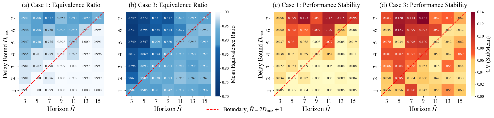

# 📊 Academic Visualization

本仓库主要用于开源本人研究工作中的实验数据绘制代码，旨在为相关研究人员提供参考与帮助。

---

## 🛠️ 环境依赖 (Prerequisites)

运行本仓库的绘图脚本需要以下基础 Python 环境：
- Python 3.8+
- matplotlib >= 3.5.0
- seaborn >= 0.11.0
- numpy, pandas

---

## 📂 目录结构与绘图索引 (Catalog)

本仓库提供两种分类方式，方便您快速查找所需的代码：

### 1. 论文分类
* [globecom-2026](globecom-2026/): 包含针对 Globecom 2026 投稿论文的可视化代码与脱敏数据。

### 2. 绘图类型分类

| 绘图类型 | 对应脚本 (Code Link) | 论文图例位置与说明 |
| :--- | :--- | :--- |
| **柱状图 (Bar Chart)** | [`plot_fig4_performance.py`](globecom-2026/plot_fig4_performance.py) | 图(a) 多基线多场景性能对比 |
| | [`plot_fig7_ablation.py`](globecom-2026/plot_fig7_ablation.py) | 图(a) 消融实验结果对比 |
| **折线图 (Line Chart)** | [`plot_fig4_performance.py`](globecom-2026/plot_fig4_performance.py) | 图(b) 性能对比曲线 |
| | [`plot_fig5_throughput.py`](globecom-2026/plot_fig5_throughput.py) | 吞吐量趋势图 |
| | [`plot_fig6_convergence.py`](globecom-2026/plot_fig6_convergence.py) | 算法收敛过程 |
| | [`plot_fig7_ablation.py`](globecom-2026/plot_fig7_ablation.py) | 图(b) 消融实验结果对比 |
| **热力图 (Heatmap)** | [`plot_fig3_heatmap.py`](globecom-2026/plot_fig3_heatmap.py) | 空间/参数热力度分布图 |

---

## 📝 论文引用 (Citation)

如果您在研究中参考了本仓库的绘图思路或使用了相关代码，请引用对应的论文：

> 📄 **Globecom 2026 投稿论文信息**
> * *Authors:* [作者姓名]
> * *Title:* [论文题目]
> * *Journal/Conference:* IEEE GLOBECOM 2026

---

## ⚠️ 注意事项与免责声明 (Disclaimers)

* **数据脱敏**：为了简洁、直观地展示与论文一致的可视化效果，本仓库提供的数据均经过脱敏、缩放或精简处理。
* **结果准则**：本仓库代码仅保证**可视化视觉效果**与原文一致，并不保证数据数值与原论文完全绝对一致。所有工作的实验结果与数据，均以对应论文的最终呈现为准。
* **免责声明**：本仓库代码按“原样”提供，作者不对代码的适用性、准确性作任何明示或暗示的保证。用户因参考、修改或运行本代码所导致的任何科研失误、计算偏差或法律纠纷，作者概不承担任何责任。
