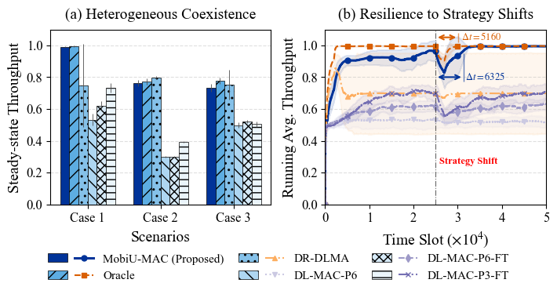
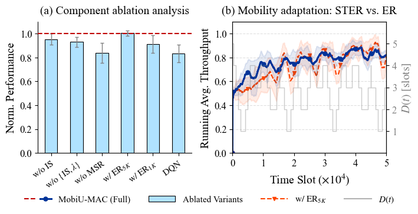
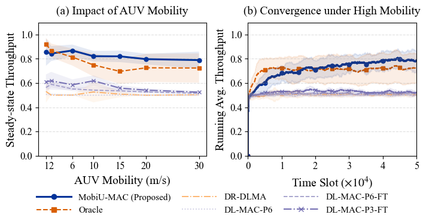
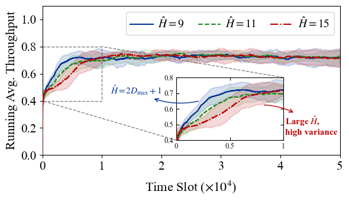

# 📊 Academic Visualization

本仓库主要用于开源本人研究工作中的实验数据绘制代码，旨在为相关研究人员提供参考与帮助。


---

## 🛠️ 环境依赖 (Prerequisites)

本项目核心基于 `matplotlib` 进行绘制。为了确保绘图效果与论文一致，建议您使用与本人相同的依赖版本。

您无需手动逐个安装，只需克隆仓库后在终端运行以下命令，即可**自动一键安装**所有必需的依赖：

```bash
pip install -r requirements.txt
```

---

## 📂 目录结构与绘图索引 (Catalog)

本仓库提供两种分类方式，方便您快速查找所需的代码：

### A. 论文分类

> [!IMPORTANT]
> **📢 如果您使用了本仓库的代码，或相关研究工作对您的学术研究有所启发，请您考虑引用我们的工作。**

* 📄 **2026 Globecom**: *“Delay-Robust Deep Reinforcement Learning for Channel Access in Mobile Underwater Acoustic Networks”*
  > 💻 **[查看绘图代码](globecom-2026/)** | 💡 **[阅读论文 (arXiv/PDF Link)](https://arxiv.org/abs/2605.06536)**
  > 
  > <details>
  > <summary><b>📋 BibTeX 引用格式 (Click to expand)</b></summary>
  >
  > ```bibtex
  > @article{ye2026mobiu,
  >   title={Delay-Robust Deep Reinforcement Learning for Ranging-Free Channel Access under Mobility in Underwater Acoustic Networks},
  >   author={Ye, Huaisheng and Ye, Xiaowen and Fu, Liqun},
  >   journal={arXiv preprint arXiv:2605.06536},
  >   year={2026}
  > }
  > ```
  > </details>

### B. 绘图类型分类

| 绘图类型 | 对应脚本 (Code Link) | 插图位置与说明 |
| :--- | :--- | :--- |
| **柱状图 (Bar Chart)** | [`plot_fig4_performance.py`](globecom-2026/plot_fig4_performance.py) | 图(a) 多基线多场景性能对比<br> <details open><summary>🔍 预览</summary><br></details> |
| | [`plot_fig7_ablation.py`](globecom-2026/plot_fig7_ablation.py) | 图(a) 消融实验结果对比 <details><summary>🔍 预览</summary><br></details> |
| **折线图 (Line Chart)** | [`plot_fig5_throughput.py`](globecom-2026/plot_fig5_throughput.py) | 吞吐量趋势图 <details open><summary>🔍 预览</summary><br></details> |
| | [`plot_fig4_performance.py`](globecom-2026/plot_fig4_performance.py) | 图(b) 性能对比曲线 <details><summary>🔍 预览</summary><br></details> |
| | [`plot_fig6_convergence.py`](globecom-2026/plot_fig6_convergence.py) | 算法收敛过程 <details><summary>🔍 预览</summary><br></details> |
| | [`plot_fig7_ablation.py`](globecom-2026/plot_fig7_ablation.py) | 图(b) 消融实验结果对比 <details><summary>🔍 预览</summary><br></details> |
| **热力图 (Heatmap)** | [`plot_fig3_heatmap.py`](globecom-2026/plot_fig3_heatmap.py) | 空间/参数热力度分布图 <details open><summary>🔍 预览</summary><br></details> |

---

## ⚠️ 注意事项与免责声明 (Disclaimers)

* **数据脱敏**：为了简洁、直观地展示与论文一致的可视化效果，本仓库提供的数据均经过脱敏、缩放或精简处理。
* **结果准则**：本仓库代码仅保证**可视化视觉效果**与原文一致，并不保证数据数值与原论文完全绝对一致。所有工作的实验结果与数据，均以对应论文的最终呈现为准。
* **免责声明**：本仓库代码按“原样”提供，作者不对代码的适用性、准确性作任何明示或暗示的保证。用户因参考、修改或运行本代码所导致的任何科研失误、计算偏差或法律纠纷，作者概不承担任何责任。
